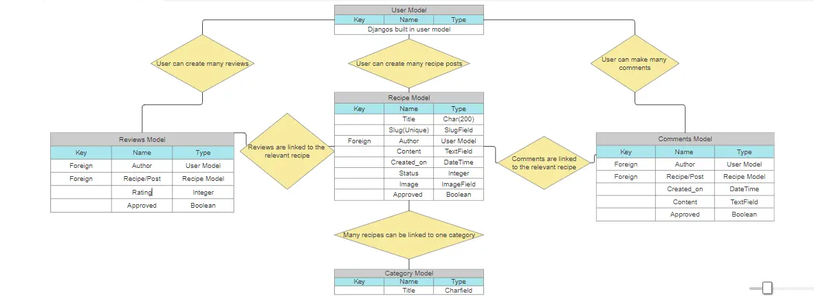
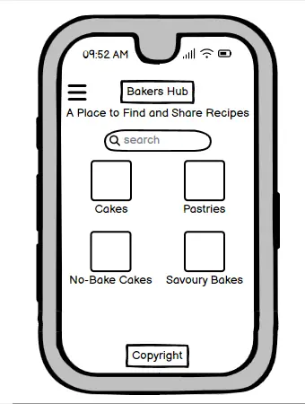
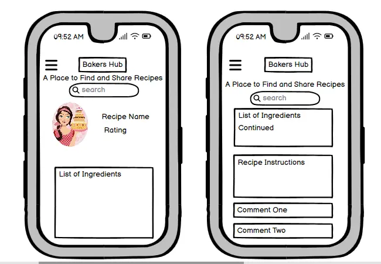
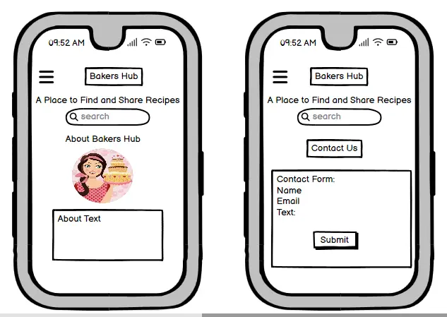
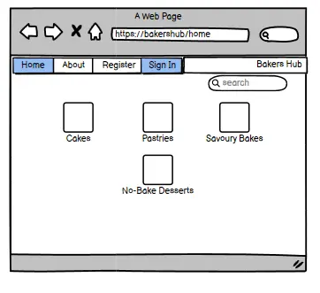
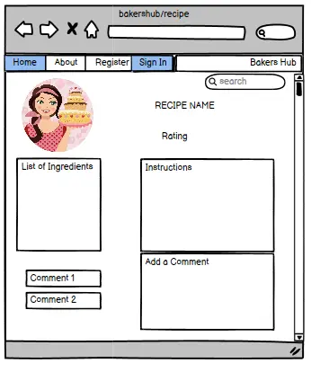
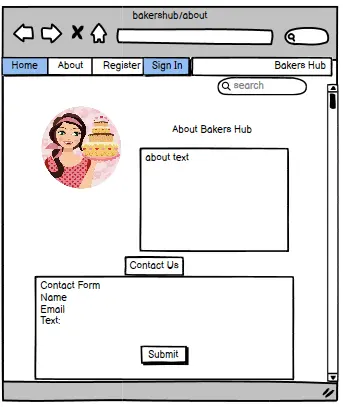

# Bakers Hub

A blog site for bakers to browse and share recipes

## User Stories

- As a site user I want to see a paginated list of posts so I can choose what to read.
- As a Site User I want to be able to contact admin with any issues.
- As a Site User I want to be able to open a recipe to read it in full.
- As a Site User I want to be able to add content such as recipes and images to the site.
- As a Site user I want to be able to edit comments.
- As a Site User I want to be able to create an account to post and comment on the website.
- As a Site User I want to be able to delete recipes and posts.
- As a Site User I want to be able to post reviews of a recipe.
- As a Site User I want to be able to read about the website.
- As a site user I would like to have a search bar to be able to quickly find a particular post.
- As a Site User I want to be able to delete comments.
- As a site user I want to be able to view my previous posts and comments.
- As a Site User I want to be able to edit my recipes and posts.

- As a Site Admin I want to be able to review and approve comments.
- As a site Admin I want to be able to review and approve posts/recipes.

## ERD

## Wireframes

- Mobile Wireframe

- Home Page
 

- Recipe Page
  
  
- About Page
  

- Desktop Wireframe

- Home Page
  
  
- Recipe Page
  
  
- About Page
  