# Bakers Hub

A blog site for bakers to browse and share recipes
[Bakers Hub live site](https://bakers-hub-afebe583acd6.herokuapp.com/)

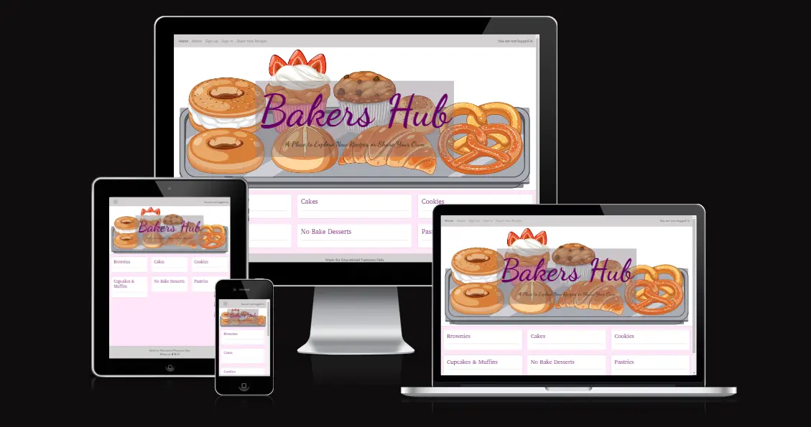

# Table Of Content

- [User Experience](#user-experience)
  - [User Stories](#user-stories)
- [Design](#design)
  - [ERD](#erd)
  - [Wireframes](#wireframes)
  - [Fonts](#fonts)
  - [Colour Scheme](#colour-scheme)
- [Development](#development)
  - [Agile Methodology](#agile-methodology)
    - [EPICS(Milestones)](#epics---milestones)
  - [Technologies Used](#technologies-used)
- [Features](#features)
  - [Flow of the Website](#flow-of-the-website)
  - [Create an account](#create-an-account)
  - [Create Posts](#create-posts)
  - [Reply to Comments](#reply-to-comments)
  - [Star Rating](#star-rating)
  - [CRUD Functionality](#crud-functionality)
- [Future Features](#future-features)
- [Testing](#testing)
- [Deployment](#deployment)
  - [Clone the Repository](#clone-the-repository)
  - [Fork the Repository](#fork-the-repository)
  - [Heroku](#heroku)
- [Credits](#credits)
  - [Content](#content)
  - [Code](#code)
  - [Acknowledgements](#acknowledgements)

## User Experience

### User Stories

Developer:

- As a developer I need to ensure sensitive information is stored safely.
- As a developer I need to create models for the functionality of the site, and to ensure data gets saved correctly to the database.
- As a developer I need to Create a base template including navbar and footer for other pages to inherit from.
- As a developer I need to deploy the site to heroku so others can use the site
- As a developer I need to complete a README.

Site Admin:

- As a Site Admin I want to be able to review and approve comments.
- As a Site Admin I want to be able to review and approve posts/recipes.

Site User:

- As a Site User I want to see a paginated list of posts so I can choose what to read.
- As a Site User I want to be able to contact admin with any issues.
- As a Site User I want to be able to open a recipe to read it in full.
- As a Site User I want to be able to add content such as recipes and images to the site.
- As a Site User I want to be able to reply to other users comments.
- As a Site User I want to be able to create an account to post and comment on the website.
- As a Site User I want to be able to comment on recipes.
- As a Site User I want to be able to delete recipes and posts.
- As a Site User I want to be able to post reviews of a recipe.
- As a Site User I want to be able to read about the website.
- As a Site User I want to be able to delete comments.
- As a Site User I want to be able to delete my replies to comments.
- As a Site User I want to be able to edit my recipes and posts.

## Design

### ERD

### Wireframes

- Mobile Wireframe

- Home Page
  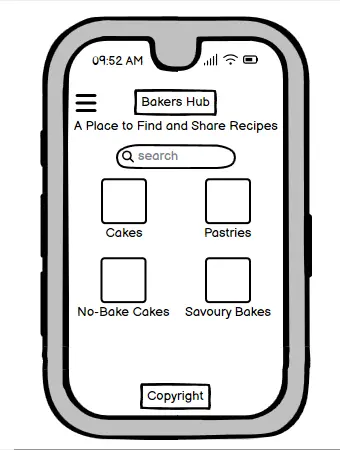

- Recipe Page
  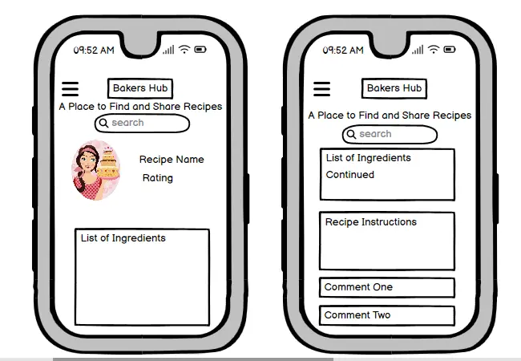
- About Page
  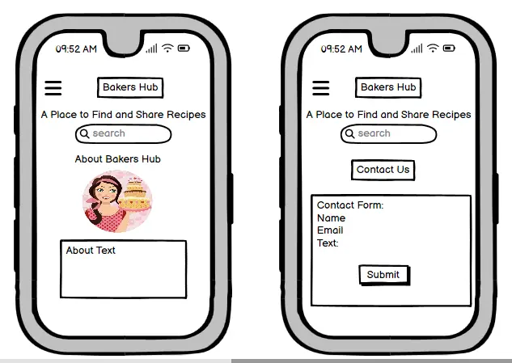

- Desktop Wireframe

- Home Page
  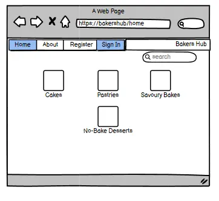
- Recipe Page
  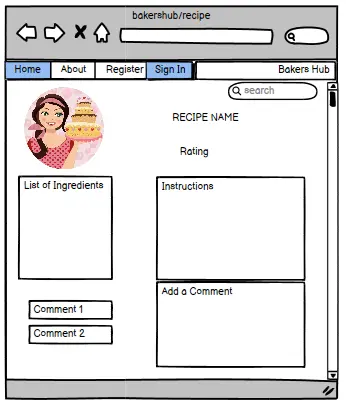
- About Page
  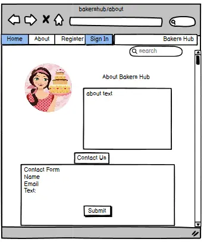

### Fonts

The fonts Annapurna and Dancing Script from Google Fonts were chosen for their aesthetic look and becasue they are clear and easy to read. Dancing Script was used for the logo and Annapurna for the content.

### Colour Scheme

I chose shades of pink, purple, grey and white as they are a nice combination. I chose paler tones for background shades and darker, bolder tones for text to provide a nice contrast that is easily readable.

## Development

### Agile Methodology

This project was developed using the Agile methodology. All epics and user stories progress was tracked through Github projects Kanban Board. [Kanban Board](https://github.com/users/amy-1989/projects/3)

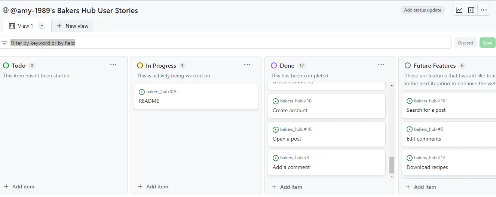

#### Epics(Milestones)

Epic 1: Initial SetUp

- As a developer, I need to create the base.html template, including navbar and footer so that other pages can reuse the layout
- As a developer I need to create an env.py file to store sensitive data for security reasons.
- As a developer, I need to create a static folder so that images, css and javascript work on the website
- As a developer, I need to set up the models so that the websites main functions will work
- As a developer I need to set up the admin file so that I can test the backend functionality

Epic 2: Social Interactions

- As a user I would like to be able to comment an share my thoughts on a recipe
- As a user I would like to be able to reply to other users comments if I wish to have a discussion
- As a user I would like to be able to delete my comments and replies if I no longer want other users to see them
- As a user I would like to be able to rate a recipe if I have tried it
- As a user I would like to be able to edit my rating if I change my mind.
- As a user I would like to be able to delete my rating if I no longer wish to share it

Epic 3: Viewing and Creating Recipes

- As a user, I would like to be able to browse recipe posts on the website
- As a user, I would like to be able to add my own recipes if I wish to share them
- As a user, I would like to be able to edit my recipes if needed
- As a user I would like to be able to delete my recipes if I no longer want to share them
- As a user I would like to be able to add a picture to compliment my recipe

Epic 4: User Sign Up and Authentication

- As a developer, I need to set up the Sign Up page using django-allauth
- As a developer, I need to set up the Sign in page using django-allauth
- As a developer, I need to set up the Sign out page using django-allauth
- As a site owner, I would like the sites authentication pages to be styled to match the websites theming

Epic 5: Documentation

- As a developer I need to complete the README

Epic 6: Deployment

- As a developer, I need to deploy the project to heroku so that users can visit and use the site
- As a developer I need to ensure all sensitive information is stored in an env file so they are secure
- As a developer I need to ensure that debug is set to false before deployment to prevent compromising the site

### Technologies Used

- Python
- HTML
- CSS
- GitHub
- GitPod
- Git
- Code Anywhere
- Heroku
- Cloudconvert
- Favicon.io
- Am I responsive
- Font Awesome
- Bootstrap5
- Google Fonts
- CI Python Validator
- HTML - W3C HTML Validator
- CSS - Jigsaw CSS Validator
- Javascrpt - JSHint
- TablesGenerator
- Chrome Dev Tools
- Cloudinary
- LightHouse
- Whitenoise
- Django

## Features

### Flow of the Website

I designed the website with ease of use for the user in mind. I wanted to keep the posts in an organised manner that users can intuitively navigate seamlessly through.
Upon landing on the site, users are greeted with the home page which displays recipe categorys on cards.

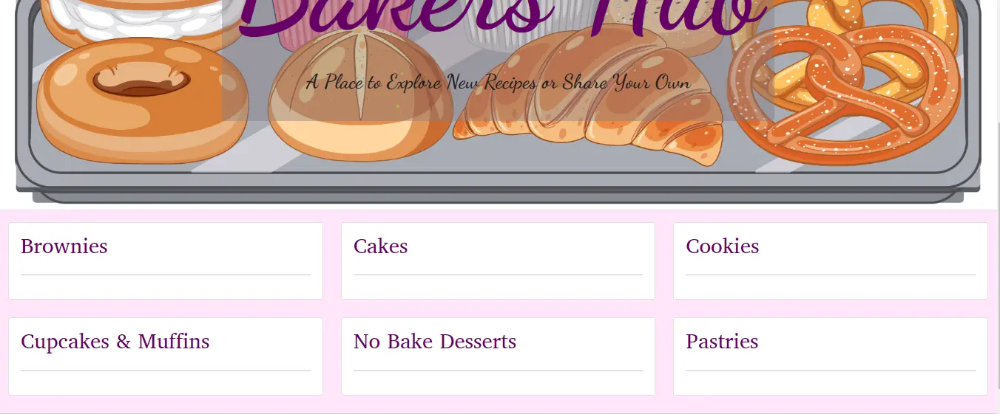

A user can click on a category and are then brought to the page of the relevant category. This page shows a list of recipe cards to choose from.

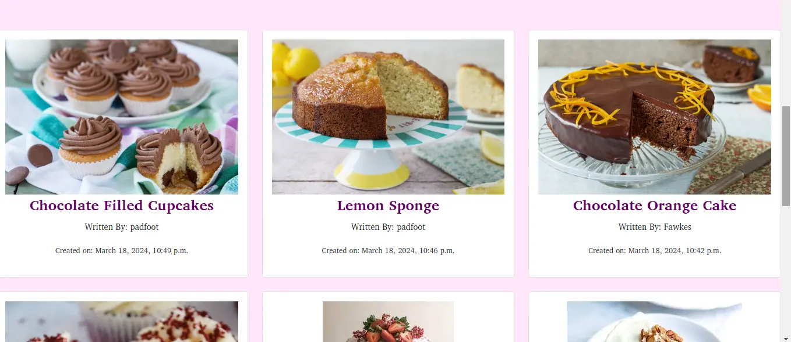

Users then choose which recipe they would like to browse and they will be brought to the individual recipe post page

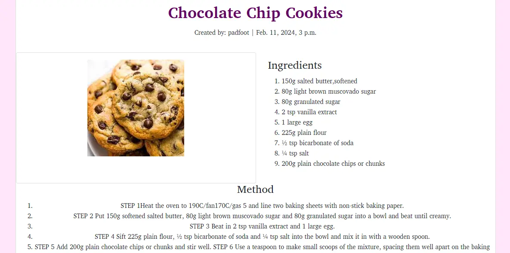

The site has an intuitively designed navbar, with clearly labelled links across the top on desktop and in a dropdown burger menu on smaller devices.

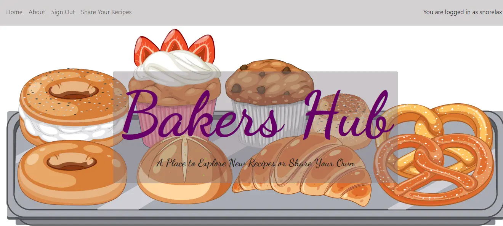

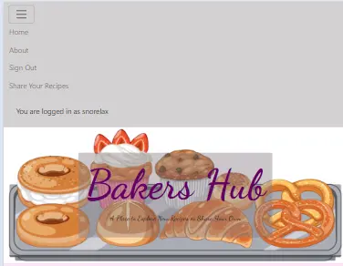

### Create Account

Users have the ability to create an account, which will allow them to comment, rate and create their own recipes.

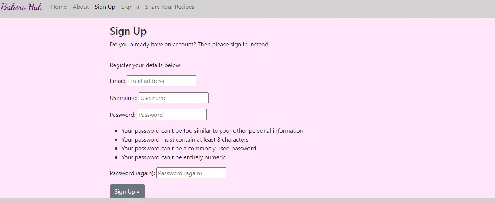

### Create Posts

Authenticated Users have the ability to share their own recipes. They can click on the link in the navbar and they will be directed to a page with a form to fill out and submit.

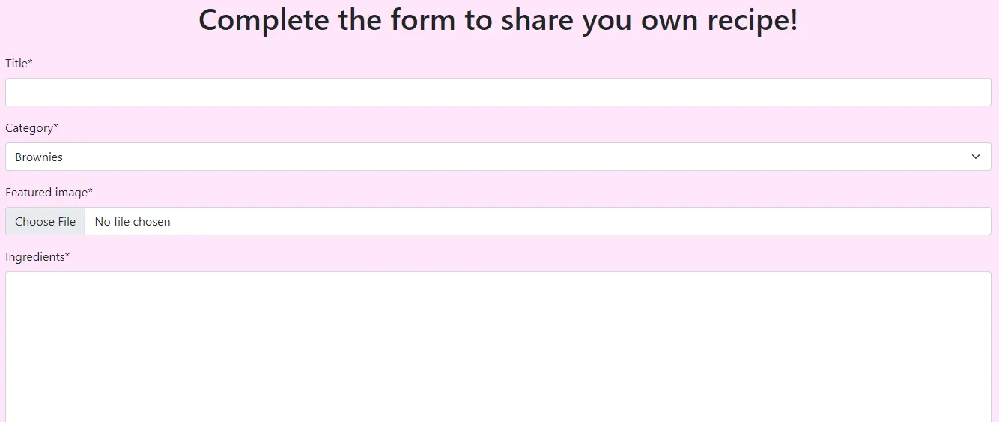

### Reply to Comments

There is a comment section at the end of each recipe page, allowing users to comment, and also reply to other users comments. Replies to comments are designed to appear within the same card as the comment being replied to, to allow users to easily follow a conversation among users in the comments section.

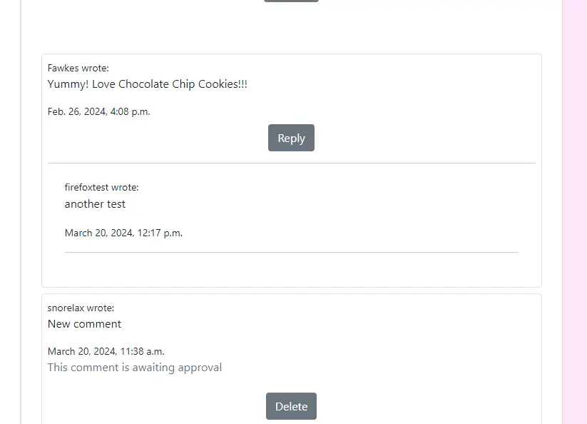

### Star Rating

There is a review section at the end of every recipe so users can rate recipes out of 5 stars.

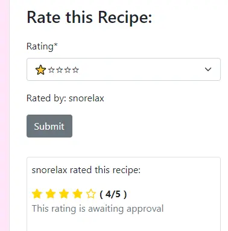

### CRUD Functionality

Their is extensive CRUD functionality designed throughout the site. Users can edit and delete their own recipes, and star ratings. They can also delete their own comments and/or replies to other comments if they so wish. Their is a two step delete process to safeguard users against accidentally deleting something they didn't mean to.

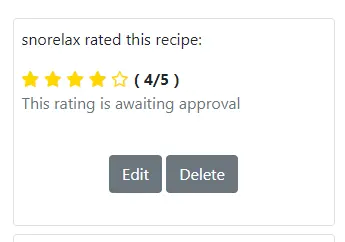

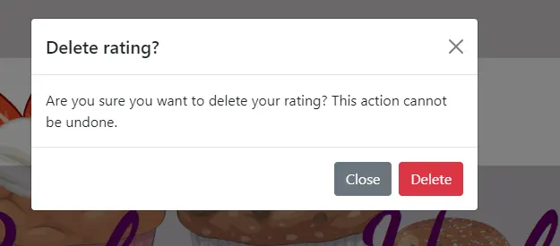

## Future Features

I would like to implement the following features in the future:

- Allow users to login and signup using a social account
- create and personalise their own profile pages
- search bar to search quickly for recipes
- download and save the recipes
- edit comments and replies

## Testing

Due to the large size of the testing section, I created a separate file to store all the tests and results. It can be found here [TESTING.md](https://github.com/amy-1989/bakers_hub/blob/main/Testing.md)

## Deployment

The site was deployed to GitHub pages. The steps to deploy are as follows:

- In the GitHub repository, navigate to the Settings tab
- From the source section drop-down menu, select the Main Branch
- Once the main branch has been selected, the page will be automatically refreshed with a detailed ribbon display to indicate the successful deployment.
- The live link can be found here - [Bakers Hub live site](https://bakers-hub-afebe583acd6.herokuapp.com/)

### Clone the Repository

- Navigate to the GitHub Repository you want to clone to use locally:

- Click on the code drop down button

- Click on HTTPS

- Copy the repository link to the clipboard

- Open your IDE of choice (git must be installed for the next steps)

- Type git clone copied-git-url into the IDE terminal

The project will now of been cloned on your local machine for use.

### Fork the repository

For creating a copy of the repository on your account and change it without affecting the original project, useFork directly from GitHub:

- On My Repository Page, press Fork in the top right of the page

- A forked version of my project will appear in your repository

### Heroku

The project was deployed using Code Institutes mock terminal for Heroku

Deployment steps:

- Fork or clone this repository.

- Ensure the Procfile is in place.

- Create a new app in Heroku

- Select "New" and "Create new app"

- Name the new app and click "Create new app"

- In "Settings" select "BuildPack" and select Python and Node.js. (Python must be at the top of the list)

- Whilst still in "Settings", click "Reveal Config Vars" and input the required hidden variables.

- Click on "Deploy" and select your deploy method and repository

- Click "Connect" on selected repository.

- Either choose "Enable Automatic Deploys" or "Deploy Branch" in the manual deploy section

- Heroku will now deploy the site

## Credits

### Content

Recipe content provided was found on BBC Good Foods website and Odlums Website

### Code

- The code in this project was inspired by Code Institutes walkthrough project I Think Therefore I Blog
- Inspiration was taken from Stack Overflow to help code the reply to comment structure
- Inspiration was also taken from Pyplanes youtube tutorials and Stack Overflow to develop the star rating functionality
- Inspiration was taken from appsloveworld.com and RealPython to develop the comments section

### Acknowledgements

- Thank you, as always, to my mentor Narender Singh for his guidance and patience in developing this project.
- Thank you to Marko from CI for answering my numerous queries.
- Thank you to tutor support for all their help on getting this project functional.
- Thank you to all those on slack who answered my questions at various stages of development.
- Thank you to my family and friends for their extensive testing of the finished site.
