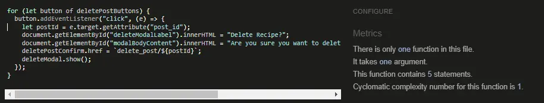

# Table of Contents

- [User Story Testing](#user-story-testing)
- [Code Validation](#code-validation)
  - [HTML](#html)
  - [CSS](#css)
  - [JavaScript](#JavaScript)
  - [Python](#python)
- [Responsiveness](#Responsiveness)
- [Browser Testing](#browser-testing)
- [Device Testing](#device-testing)
- [Lighthouse](#Lighthouse)
- [Manual Testing](#manual-testing)

  - [Site Navigation](#site-navigation)
  - [Home Page](#home-page)
  - [Category Page](#category-page)
  - [Post Page](#post-page)
  - [About Page](#about-page)
  - [Create Post Page](#create-post-page)
  - [Edit Post Page](#edit-post-page)
  - [Sign Up Page](#sign-up-page)
  - [Sign In Page](#sign-in-page)
  - [Delete Confirmation Modal](#delete-confirmation-modal)
  - [Sign Out Page](#sign-out-page)
  -

- [Bugs](#bugs)

## User Story Testing

| User Story                                                                                                                           | Test                                                                                | Result |
| ------------------------------------------------------------------------------------------------------------------------------------ | ----------------------------------------------------------------------------------- | ------ |
| - As a developer I need to ensure sensitive information is stored safely.                                                            | Env file created and sesitive data stored there. Env file added to git.ignore       | PASS   |
| - As a developer I need to create models for the functionality of the site, and to ensure data gets saved correctly to the database. | Models created and database is functional                                           | PASS   |
| - As a developer I need to Create a base template including navbar and footer for other pages to inherit from.                       | Base template created and all other pages inherit                                   | PASS   |
| - As a developer I need to deploy the site to heroku so others can use the site                                                      | Site deployed to heroku with no errors                                              | PASS   |
| - As a developer I need to complete a README.                                                                                        | README documentation complete                                                       | PASS   |
| - As a Site Admin I want to be able to review and approve comments.                                                                  | SuperUser can log in and mark comments as approved before published                 | PASS   |
| - As a Site Admin I want to be able to review and approve posts/recipes.                                                             | SuperUser can log in and mark posts as approved before published                    | PASS   |
| - As a Site User I want to see a paginated list of posts so I can choose what to read.                                               | Home page shows a list of categories, when clicked user sees a list of recipe posts | PASS   |
| - As a Site User I want to be able to contact admin with any issues.                                                                 | About page contains a contact fomr which sends request                              | PASS   |
| - As a Site User I want to be able to open a recipe to read it in full.                                                              | users can click on a post to view it in full                                        | PASS   |
| - As a Site User I want to be able to add content such as recipes and images to the site.                                            | users can add their own recipes once authenticated                                  | PASS   |
| - As a Site User I want to be able to reply to other users comments.                                                                 | authenticated users can reply to comments                                           | PASS   |
| - As a Site User I want to be able to create an account to post and comment on the website.                                          | users can use the link in the navbar to sign up and be able to post comments        | PASS   |
| - As a Site User I want to be able to comment on recipes.                                                                            | authenticated users can comment on posts                                            | PASS   |
| - As a Site User I want to be able to delete recipes and posts.                                                                      | authenticated users can delete their own posts by way of delete button              | PASS   |
| - As a Site User I want to be able to post reviews of a recipe.                                                                      | authenticated users can use a star rating to review recipes                         | PASS   |
| - As a Site User I want to be able to read about the website.                                                                        | users can visit the about page via the navbar link to learn more about the site     | PASS   |
| - As a Site User I want to be able to delete comments.                                                                               | authenticated users can delete their own comments using delete button               | PASS   |
| - As a Site User I want to be able to delete my replies to comments.                                                                 | authenticated users can delete their replies by using delete button                 | PASS   |
| - As a Site User I want to be able to edit my recipes and posts.                                                                     | authenticated users can edit their own recipes using edit button                    | PASS   |

## Code Validation

### HTML

All HTML pages were run through the [W3C HTML Validator](https://validator.w3.org/). See results in below table.

| Page         | Validation                                                                                                       | Result |
| ------------ | ---------------------------------------------------------------------------------------------------------------- | ------ |
| Index        | 

Home Page

               | PASS   |
| Category     | 

Category Page

         | PASS   |
| Post         | 

Post Page

                 | PASS   |
| Sign In      | 

Sign In Page

           | PASS   |
| Sign Out     | 

Sign Out Page

         | PASS   |
| Sign Up      | 

Sign Up Page

           | PASS   |
| Share Recipe | 

Share Recipe Page

 | PASS   |
| Edit Recipe  | 

Edit Recipe Page

   | PASS   |
| About        | 

About

                     | ERRORS |

The HTML validation errors are attributed to the Summernote widget and Django framework and not my own custom code. They cannot be resolved without removing the packages. As the packages add significant value to the site, I have chosen not to remove them.

### CSS

The CSS stylesheet was run through the [W3C CSS Validator](https://jigsaw.w3.org/css-validator/)
Test Results CSS: PASS

### JavaScript

The Javascript files in this project were run through [JSHint](https://jshint.com/). See table below for results.

| Page     | Validation                                                                                             | Result |
| -------- | ------------------------------------------------------------------------------------------------------ | ------ |
| comments | 

comments.js

 | PASS   |
| posts    | 

posts.js

       | PASS   |
| replies  | 

replies.js

    | PASS   |
| reviews  | 

reviews.js

   | PASS   |

### Python

Python files were tested using the [CI Python Linter](https://pep8ci.herokuapp.com/#). See table below for results.

| Page           | Validation                                                                                                  | Result |
| -------------- | ----------------------------------------------------------------------------------------------------------- | ------ |
| urls-project   | 

comments.js

   | PASS   |
| urls-about     | 

comments.js

    | PASS   |
| urls-recipes   | 

comments.js

           | PASS   |
| views-recipes  | 

comments.js

         | PASS   |
| views-about    | 

comments.js

   | PASS   |
| admin-recipes  | 

comments.js

          | PASS   |
| admin-about    | 

comments.js

   | PASS   |
| forms-recipes  | 

comments.js

          | PASS   |
| forms-about    | 

comments.js

  | PASS   |
| models-recipes | 

comments.js

         | PASS   |
| models-about   | 

comments.js

 | PASS   |

## Responsiveness

Throughout development, constant testing was done using Chrome Developer to test the sites responsiveness to different device widths.

Further testing was also done on real mobile devices to confirm the site is rendering as expected.

| Device             | Responsiveness | Result |
| ------------------ | -------------- | ------ |
| iPhone11           | Excellent      | PASS   |
| Samsung Galaxy A13 | Excellent      | PASS   |
| Samsung Galaxy a51 | Excellent      | PASS   |
| Samsung Galaxy a14 | Excellent      | PASS   |

## Browser Testing

The deployed site was tested on multiple browsers to confirm that everything is working as expected.

| Browser        | Appearance | Functionality | Result |
| -------------- | ---------- | ------------- | ------ |
| Chrome         | Excellent  | As expected   | PASS   |
| Microsoft Edge | Excellent  | As expected   | PASS   |
| Firefox        | Excellent  | As expected   | PASS   |
| Safari         | Excellent  | As expected   | PASS   |

### Lighthouse

The site was tested for performance and accessibility using Lighthouse on Chrome Developer Tools.
It is noted that Google Fonts, and Font Awesome icons are affecting the pages performance.

## Manual Testing

### Site Navigation

| Element                | Action  | Expected Behaviour                           | Result |
| ---------------------- | ------- | -------------------------------------------- | ------ |
| Home Link              | Click   | Redirects to Home page                       | PASS   |
| About Link             | Click   | Redirects to About page                      | PASS   |
| Sign Up Link           | Click   | Redirects to Sign Up page                    | PASS   |
| Sign In Link           | Click   | Redirects to Sign In page                    | PASS   |
| Share Your Recipe Link | Click   | Redirects to Create post page                | PASS   |
| Hamburger Menu         | Click   | Displays a dropdown list of all navbar links | PASS   |
| Sign Up Link           | Display | Displays for non-authenticated users         | PASS   |
| Sign In Link           | Display | Displays for non-authenticated users         | PASS   |
| Sign Out Link          | Display | Displays for authenticated users only        | PASS   |
| Footer Socials         | Click   | Opens relevant social page in new tab        | PASS   |
| Footer Socials         | Hover   | Highlight blue to indicate a link            | PASS   |

### Home Page

| Element        | Action  | Expected Behaviour                    | Result |
| -------------- | ------- | ------------------------------------- | ------ |
| Category cards | Display | Display in pages of 6 cards           | PASS   |
| Category Links | Hover   | Highlight blue to indicate link       | PASS   |
| Category Links | Click   | Redirects to the chosen category page | PASS   |

### Category Page

| Element      | Action  | Expected Behaviour                               | Result |
| ------------ | ------- | ------------------------------------------------ | ------ |
| Recipe Cards | Display | Displays all recipe cards in the chosen category | PASS   |
| Recipe Links | Hover   | Highlight blue to indicate link                  | PASS   |
| Recipe Links | Click   | Redirects to the chosen recipes post page        | PASS   |

### Post Page

| Element                      | Action  | Expected Behaviour                                                               | Result |
| ---------------------------- | ------- | -------------------------------------------------------------------------------- | ------ |
| Recipe                       | Display | Displays the chosen recipes content                                              | PASS   |
| Ratings Cards                | Display | Users see approved ratings                                                       | PASS   |
| Rating Form                  | Display | Non-authenticated users see message prompting log in to leave rating             | PASS   |
| Comment Form                 | Display | Non-authenticates users see message prompting a log in to leave a comment        | PASS   |
| Comment Section              | Display | Users can read approved comments and replies                                     | PASS   |
| Edit Ratings Button          | Display | Authenticated Users only can see this button                                     | PASS   |
| Delete Ratings Button        | Display | Authenticated Users only can see this button                                     | PASS   |
| Delete Comments Button       | Display | Authenticated Users only can see this button                                     | PASS   |
| Reply Button                 | Display | Authenticated Users only can see this button, only displays on approved comments | PASS   |
| Comments Form                | Display | Authenticated Users only can see this form                                       | PASS   |
| Rating Form                  | Display | Authenticated Users only can see this form                                       | PASS   |
| Star Rating Widget           | Click   | Dropdown menu allowing user to select number of stars to rate                    | PASS   |
| Rating Section Submit Button | Click   | Submits user rating for recipe                                                   | PASS   |
| Add Comment Submit Button    | Click   | Adds comment to the page                                                         | PASS   |
| Edit Ratings Button          | Click   | Allows user to edit rating using the dropdown star widget rating                 | PASS   |
| Delete Ratings Button        | Click   | Renders the delete confirmation modal                                            | PASS   |
| Delete Comments Button       | Click   | Renders the delete confirmation modal                                            | PASS   |
| Edit Post Button             | Click   | Redirects to the edit post page                                                  | PASS   |
| Delete Post Button           | Click   | Renders the delete confirmation modal                                            | PASS   |
| Edit Post Button             | Display | Displays to the authenticated author of the post only                            | PASS   |
| Delete Post Button           | Display | Displays to the authenticated author of the post only                            | PASS   |
| Reply Button                 | Click   | Renders the reply form                                                           | PASS   |
| Add Reply Button             | Click   | Submits reply                                                                    | PASS   |

### About Page

| Element           | Action  | Expected Behaviour                         | Result |
| ----------------- | ------- | ------------------------------------------ | ------ |
| Contact Us Button | Hover   | Darkens when hovered over                  | PASS   |
| Contact Us Form   | Display | Displays to users below after button click | PASS   |
| Submit Button     | Hover   | Darkens when hovered over                  | PASS   |
| Submit Button     | Click   | Submits contact form                       | PASS   |
| Contact Us Button | Click   | Displays the contact us form               | PASS   |

### Create Post Page

| Element          | Action  | Expected Behaviour                                      | Result |
| ---------------- | ------- | ------------------------------------------------------- | ------ |
| Create Post Form | Display | Displays to authenticated users                         | PASS   |
| Create Post Form | Display | Unauthenticates users see a message prompting a sign in | PASS   |
| Submit Button    | Hover   | Darkens when hovered over                               | PASS   |
| Submit Button    | Click   | Submits create post form                                | PASS   |

### Edit Post Page

| Element              | Action  | Expected Behaviour                                            | Result |
| -------------------- | ------- | ------------------------------------------------------------- | ------ |
| Form                 | Display | Displays with fields full with previous submitted information | PASS   |
| Update Recipe Button | Click   | Submits edited recipe                                         | PASS   |
| Update Recipe Button | Hover   | Darkens when hovered over                                     | PASS   |
| Invalid inputs       | Submit  | User is directed to the problem field to fix                  | PASS   |

### Sign Up Page

| Element        | Action | Expected Behaviour                                                               | Result |
| -------------- | ------ | -------------------------------------------------------------------------------- | ------ |
| Sign In Link   | Hover  | Highlights blue to indicate a link                                               | PASS   |
| Sign Up Button | Click  | Creates an authenticated user, displays you are logged in as message             | PASS   |
| Sign Up Button | Hover  | Darkens when hovered over                                                        | PASS   |
| Invalid inputs | Submit | User is prompted to fill in empty fields/choose different usernames/email inputs | PASS   |

### Sign In Page

| Element              | Action | Expected Behaviour                                                   | Result |
| -------------------- | ------ | -------------------------------------------------------------------- | ------ |
| Sign Up Link         | Hover  | Highlights blue to indicate a link                                   | PASS   |
| Sign In Button       | Click  | Logs an authenticated user in, displays you are logged in as message | PASS   |
| Sign In Button       | Hover  | Darkens when hovered over                                            | PASS   |
| Invalid inputs       | Submit | User is prompted to fix errors with messages indicating the error    | PASS   |
| Remember me checkbox | Click  | Saves user data for smoother login upon returning in same browser    | PASS   |

### Delete Confirmation Modal

| Element       | Action | Expected Behaviour                          | Result |
| ------------- | ------ | ------------------------------------------- | ------ |
| Close Button  | Hover  | Darkens when hovered over                   | PASS   |
| Delete Button | Hover  | Darkens when hovered over                   | PASS   |
| Close Button  | Click  | Closes the modal box, no delete takes place | PASS   |
| Delete Button | Click  | Chosen Item is deleted                      | PASS   |

### Sign Out Page

| Element         | Action | Expected Behaviour                                                          | Result |
| --------------- | ------ | --------------------------------------------------------------------------- | ------ |
| Sign Out Button | Hover  | Darkens when hovered over                                                   | PASS   |
| Sign Out Button | Click  | Signs out the user, displays message letting user know they have logged out | PASS   |

## Bugs

There are no unresolved bugs at the time of submission.
