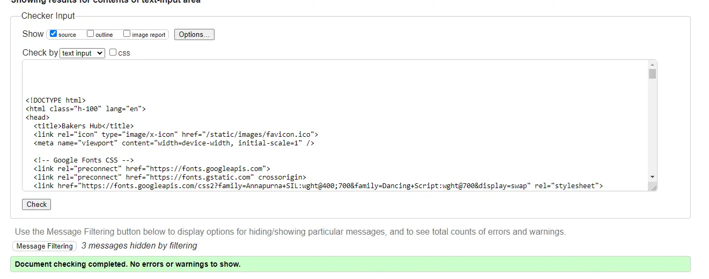
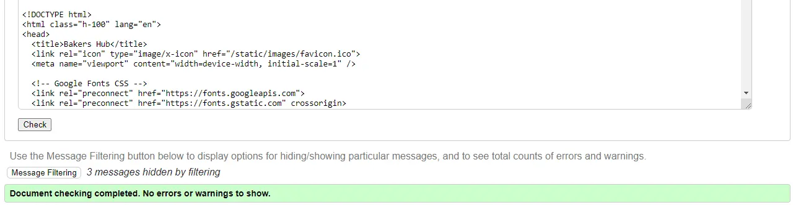
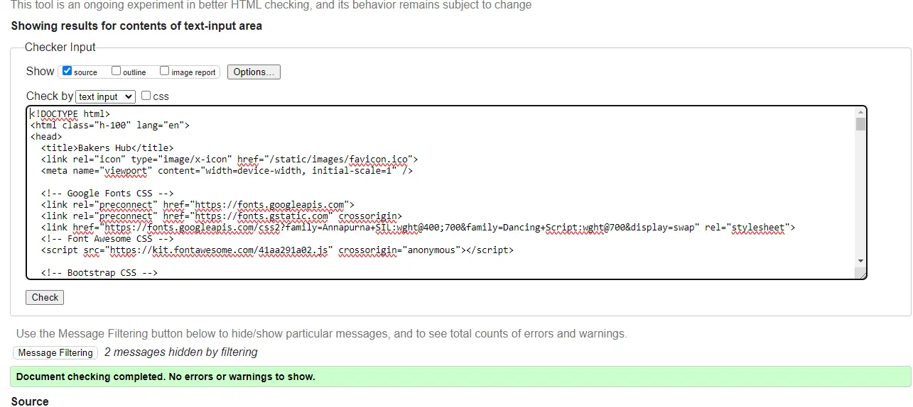
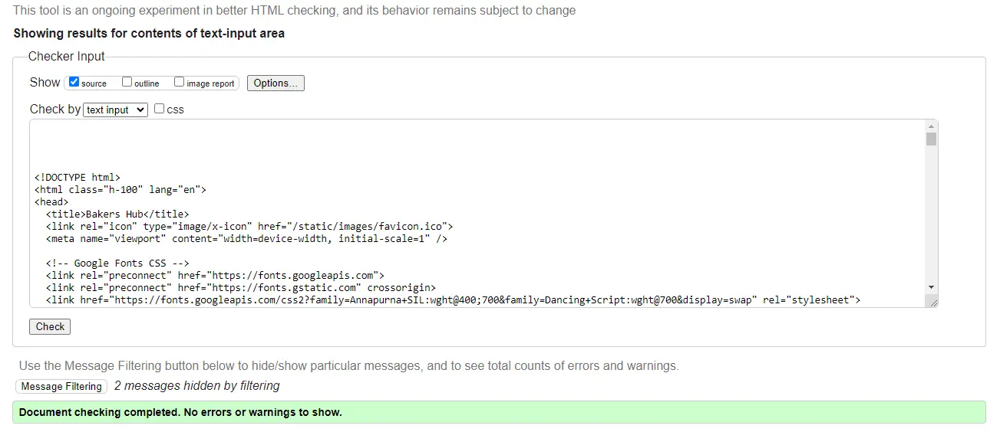
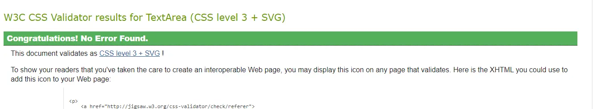
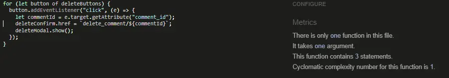
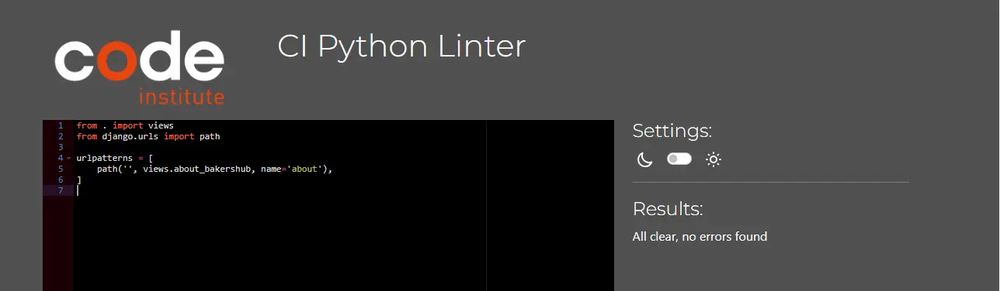
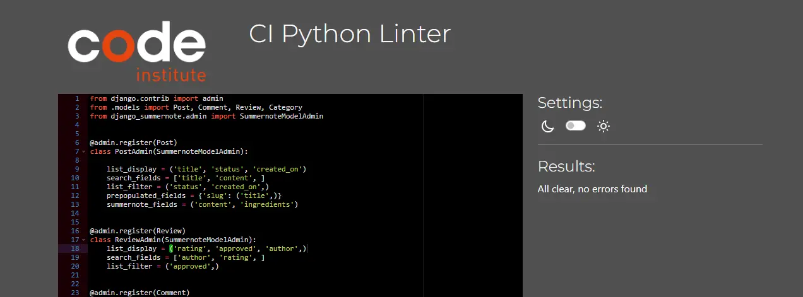
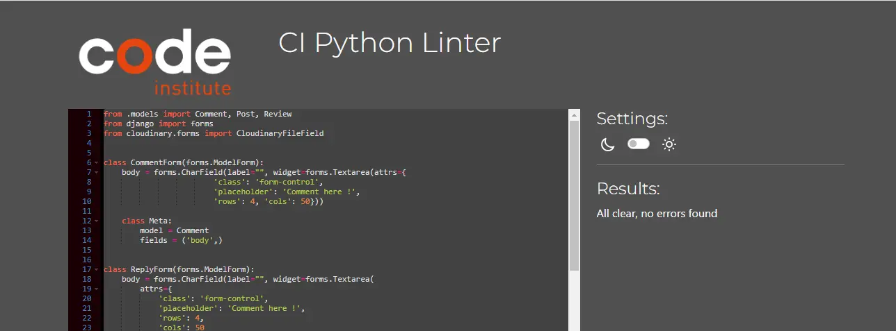

# Table of Contents

- [User Story Testing](#user-story-testing)
- [Code Validation](#code-validation)
  - [HTML](#html)
  - [CSS](#css)
  - [JavaScript](#JavaScript)
  - [Python](#python)
- [Responsiveness](#Responsiveness)
- [Browser Testing](#browser-testing)
- [Device Testing](#device-testing)
- [Lighthouse](#Lighthouse)
- [Manual Testing](#manual-testing)

  - [Site Navigation](#site-navigation)
  - [Home Page](#home-page)
  - [Category Page](#category-page)
  - [Article Preview Card](#article-preview-card)
  - [Post Detail Page](#post-detail-page)
  - [Comment](#comment)
  - [Add Post Page](#add-post-page)
  - [Edit Post Page](#edit-post-page)
  - [Delete Confirmation Modal](#delete-confirmation-modal)
  - [Profile Page](#profile-page)
  - [Update Profile Page](#update-profile-page)
  - [Sign Up Page](#sign-up-page)
  - [Sign In Page](#sign-in-page)
  - [Log Out Page](#log-out-page)
  - [Code of Conduct Page](#code-of-conduct-page)

- [Bugs](#bugs)

## User Story Testing

| User Story                                                                                                                           | Test                                                                                | Result |
| ------------------------------------------------------------------------------------------------------------------------------------ | ----------------------------------------------------------------------------------- | ------ |
| - As a developer I need to ensure sensitive information is stored safely.                                                            | Env file created and sesitive data stored there. Env file added to git.ignore       | PASS   |
| - As a developer I need to create models for the functionality of the site, and to ensure data gets saved correctly to the database. | Models created and database is functional                                           | PASS   |
| - As a developer I need to Create a base template including navbar and footer for other pages to inherit from.                       | Base template created and all other pages inherit                                   | PASS   |
| - As a developer I need to deploy the site to heroku so others can use the site                                                      | Site deployed to heroku with no errors                                              | PASS   |
| - As a developer I need to complete a README.                                                                                        | README documentation complete                                                       | PASS   |
| - As a Site Admin I want to be able to review and approve comments.                                                                  | SuperUser can log in and mark comments as approved before published                 | PASS   |
| - As a Site Admin I want to be able to review and approve posts/recipes.                                                             | SuperUser can log in and mark posts as approved before published                    | PASS   |
| - As a Site User I want to see a paginated list of posts so I can choose what to read.                                               | Home page shows a list of categories, when clicked user sees a list of recipe posts | PASS   |
| - As a Site User I want to be able to contact admin with any issues.                                                                 | About page contains a contact fomr which sends request                              | PASS   |
| - As a Site User I want to be able to open a recipe to read it in full.                                                              | users can click on a post to view it in full                                        | PASS   |
| - As a Site User I want to be able to add content such as recipes and images to the site.                                            | users can add their own recipes once authenticated                                  | PASS   |
| - As a Site User I want to be able to reply to other users comments.                                                                 | authenticated users can reply to comments                                           | PASS   |
| - As a Site User I want to be able to create an account to post and comment on the website.                                          | users can use the link in the navbar to sign up and be able to post comments        | PASS   |
| - As a Site User I want to be able to comment on recipes.                                                                            | authenticated users can comment on posts                                            | PASS   |
| - As a Site User I want to be able to delete recipes and posts.                                                                      | authenticated users can delete their own posts by way of delete button              | PASS   |
| - As a Site User I want to be able to post reviews of a recipe.                                                                      | authenticated users can use a star rating to review recipes                         | PASS   |
| - As a Site User I want to be able to read about the website.                                                                        | users can visit the about page via the navbar link to learn more about the site     | PASS   |
| - As a Site User I want to be able to delete comments.                                                                               | authenticated users can delete their own comments using delete button               | PASS   |
| - As a Site User I want to be able to delete my replies to comments.                                                                 | authenticated users can delete their replies by using delete button                 | PASS   |
| - As a Site User I want to be able to edit my recipes and posts.                                                                     | authenticated users can edit their own recipes using edit button                    | PASS   |

## Code Validation

### HTML

All HTML pages were run through the [W3C HTML Validator](https://validator.w3.org/). See results in below table.

| Page         | Validation                                                                                                       | Result |
| ------------ | ---------------------------------------------------------------------------------------------------------------- | ------ |
| Index        | 

Home Page

               | PASS   |
| Category     | 

Category Page

         | PASS   |
| Post         | 

Post Page

                 | PASS   |
| Sign In      | 

Sign In Page

           | PASS   |
| Sign Out     | 

Sign Out Page

         | PASS   |
| Sign Up      | 

Sign Up Page

           | PASS   |
| Share Recipe | 

Share Recipe Page

 | PASS   |
| Edit Recipe  | 

Edit Recipe Page

   | PASS   |
| About        | 

About

                     | ERRORS |

The HTML validation errors are attributed to the Summernote widget and Django framework and not my own custom code. They cannot be resolved without removing the packages. As the packages add significant value to the site, I have chosen not to remove them.

### CSS

The CSS stylesheet was run through the [W3C CSS Validator](https://jigsaw.w3.org/css-validator/)
Test Results CSS <mark>PASS<mark>

### JavaScript

The Javascript files in this project were run through [JSHint](https://jshint.com/). See table below for results.

| Page     | Validation                                                                                             | Result |
| -------- | ------------------------------------------------------------------------------------------------------ | ------ |
| comments | 

comments.js

 | PASS   |
| posts    | 

posts.js

       | PASS   |
| replies  | 

replies.js

    | PASS   |
| reviews  | 

reviews.js

   | PASS   |

### Python

Python files were tested using the [CI Python Linter](https://pep8ci.herokuapp.com/#). See table below for results.

| Page           | Validation                                                                                                  | Result |
| -------------- | ----------------------------------------------------------------------------------------------------------- | ------ |
| urls-project   | 

comments.js

   | PASS   |
| urls-about     | 

comments.js

    | PASS   |
| urls-recipes   | 

comments.js

           | PASS   |
| views-recipes  | 

comments.js

         | PASS   |
| views-about    | 

comments.js

   | PASS   |
| admin-recipes  | 

comments.js

          | PASS   |
| admin-about    | 

comments.js

   | PASS   |
| forms-recipes  | 

comments.js

          | PASS   |
| forms-about    | 

comments.js

  | PASS   |
| models-recipes | 

comments.js

         | PASS   |
| models-about   | 

comments.js

 | PASS   |

## Responsiveness

Throughout development, constant testing was done using Chrome Developer to test the sites responsiveness to different device widths.

Further testing was also done on real mobile devices to confirm the site is rendering as expected.

| Device             | Responsiveness | Result |
| ------------------ | -------------- | ------ |
| iPhone11           | Excellent      | PASS   |
| Samsung Galaxy A13 | Excellent      | PASS   |
| Samsung Galaxy a51 | Excellent      | PASS   |
| Samsung Galaxy a14 | Excellent      | PASS   |

## Browser Testing

The deployed site was tested on multiple browsers to confirm that everything is working as expected.

| Browser        | Appearance | Functionality | Result |
| -------------- | ---------- | ------------- | ------ |
| Chrome         | Excellent  | As expected   | PASS   |
| Microsoft Edge | Excellent  | As expected   | PASS   |
| Firefox        | Excellent  | As expected   | PASS   |
| Safari         | Excellent  | As expected   | PASS   |

### Lighthouse

The site was tested for performance and accessibility using Lighthouse on Chrome Developer Tools.
It is noted that Google Fonts, and Font Awesome icons are affecting the pages performance.

## Manual Testing

### Site Navigation

### Home Page

### Category Page

### Post Page

### About Page

### Create Post Page

### Edit Post Page

### Sign Up Page

### Sign In Page

### Delete Confirmation Modal

### Sign Out Page

## Bugs

There are no unresolved bugs at the time of submission.
